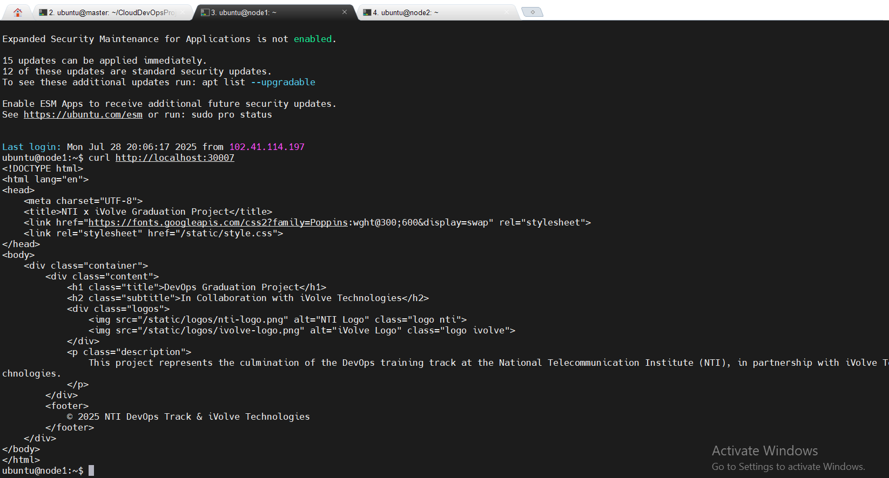

<p align="center">
  
  &nbsp;&nbsp;&nbsp;&nbsp;
  
</p>

<h1 align="center" style="font-family: 'Poppins', sans-serif; color: #e0e0e0; font-size: 2.8rem;">
   DevOps Graduation Project
</h1>

<h3 align="center" style="font-family: 'Poppins', sans-serif; color: #b0bec5;">
  In Collaboration with iVolve Technologies
</h3>

<p align="center" style="max-width: 700px; font-size: 1.1rem; color: #cfd8dc;">
  This project represents the culmination of the DevOps training at the National Telecommunication Institute (NTI),
  in partnership with iVolve Technologies. 
</p>
---

## ✅ Containerization with Docker

- Dockerfile created to containerize the Flask application.
- Image built successfully: `final-app:latest`.
- Docker image pushed to Docker Hub: [`mohamedanter845/flask-app`](https://hub.docker.com/repository/docker/mohamedanter845/flask-app).
- Container tested and working locally via port `5000`
```
---

## ✅ Step 3: Deploy Backend App on Kubernetes Cluster (NodePort Service)

In this step, we manually deployed the backend application on a **self-managed Kubernetes cluster** using a combined manifest file that includes both the **Deployment** and the **NodePort Service**.

- The manifest file is located at:  
  `backend/backend-deployment.yaml`
  
- This file includes:
  - 🧱 `Deployment`: to manage the backend pod(s)
  - 🌐 `Service` of type `NodePort`: to expose the app internally across cluster nodes

- We applied the manifest using:

  ```bash
  kubectl apply -f backend/backend-deployment.yml

-------
After applying:

The backend pod was scheduled to run on node1

The NodePort service exposed the app on port 30007

We verified the deployment by running curl on node1 and got a proper response

<div align="center">  </div> 
