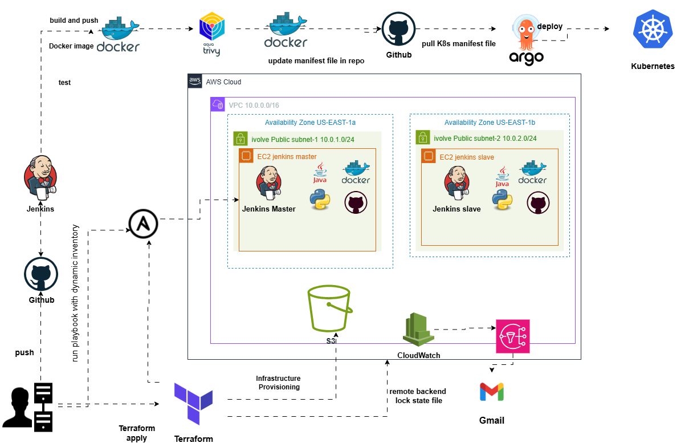

<p align="center">
  
  &nbsp;&nbsp;&nbsp;&nbsp;
  
</p>

<h1 align="center" style="font-family: 'Poppins', sans-serif; color: #e0e0e0; font-size: 2.8rem;">
   DevOps Graduation Project
</h1>

<h3 align="center" style="font-family: 'Poppins', sans-serif; color: #b0bec5;">
  In Collaboration with iVolve Technologies
</h3>
---


# 🚀 DevOps CI/CD Infrastructure Project

A complete infrastructure to implement DevOps practices using modern tools such as Terraform, Ansible, Jenkins, ArgoCD, and Kubernetes. The goal of this project is to build a scalable system that automates CI/CD pipelines for containerized applications on AWS.

---


---
## 🧱 Project Components

### 🔧 1. AWS Infrastructure with Terraform
- Custom VPC setup with subnets.
- EC2 Instances:
  - One for Jenkins Master.
  - One for Jenkins Agent (Worker).
- Proper IAM roles, Security Groups, and networking configuration.
- S3 and DynamoDB used as Remote Backend for Terraform state management.

---

### ⚙️ 2. Server Configuration with Ansible
- Jenkins Master installation and setup.
- Jenkins Agent configuration to handle builds.
- Kubernetes cluster setup using `kubeadm` on the EC2 instances.

---

### 🔄 3. CI/CD Pipeline with Jenkins
- When code is pushed to GitHub:
  - Jenkins detects changes automatically.
  - Pipeline is triggered:
    - Runs basic unit tests.
    - Builds a new Docker image.
    - Pushes the image to a container registry.
    - Updates Kubernetes manifests.
    - Pushes updated YAML files back to GitHub.

---

### 🌐 4. Continuous Deployment with ArgoCD
- ArgoCD continuously watches the GitHub repository.
- Any change in Kubernetes manifests is automatically synced with the Kubernetes cluster.
- Ensures the live state always matches the desired state from Git.

---

### ☸️ 5. Kubernetes Cluster (kubeadm)
- One master node and one worker node.
- The application is deployed using YAML manifest files.
- A dedicated Namespace is used for application resources to keep things organized.

---

## 📦 Tools & Technologies
| Tool        | Purpose |
|-------------|---------|
| **Terraform** | Infrastructure as Code for AWS provisioning |
| **Ansible**   | Server setup and configuration automation |
| **Jenkins**   | CI/CD pipeline orchestration |
| **Docker**    | Containerization of the application |
| **Kubernetes**| Deployment and management of application workloads |
| **ArgoCD**    | GitOps-based Continuous Deployment |

---

## 📁 Project Structure
```
.
├── terraform/         # Infrastructure as Code with Terraform
├── Ansible/           # Playbooks and roles for server configuration
├── Jenkins/           # Jenkinsfile and pipeline setup
├── app/               # Application source code + Dockerfile
├── k8s-manifests/     # Kubernetes deployment YAML files
├── ArgoCD/            # ArgoCD application definitions
└── README.md
```

---

## 📝 Prerequisites
- An active AWS account with sufficient permissions
- Docker and Git installed locally
- Basic understanding of the following tools:
  - Terraform
  - Ansible
  - Jenkins
  - Kubernetes
  - GitOps and ArgoCD
BY MOHAMED ANTER
