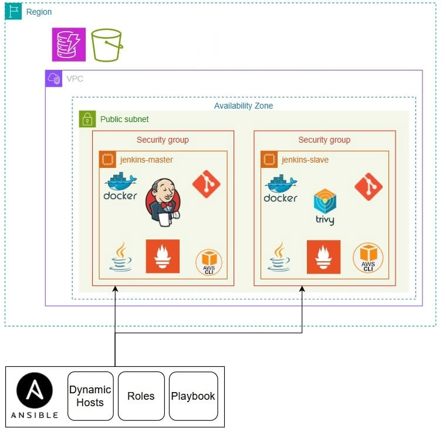
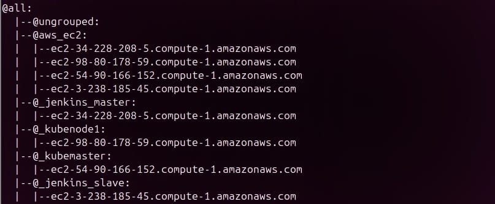
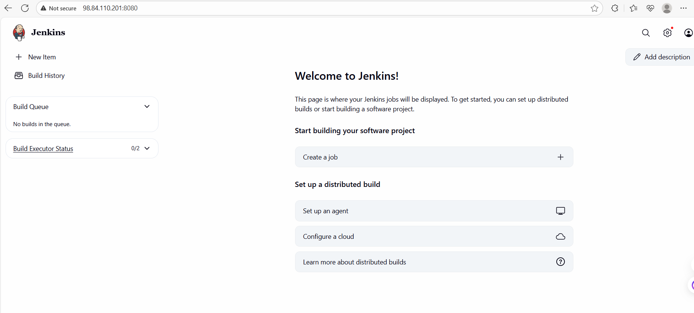

# Jenkins Infrastructure Configuration with Ansible
This part of project contains an Ansible-based automation for provisioning and configuring a CI/CD environment on AWS EC2 instances. It includes roles for installing Jenkins (Master/Slave), Docker, Git, Java, Trivy, AWS CLI, and Node Exporter.


----------------
## Project Structure

```
ansible/
├── ansible.cfg
├── inventory /aws_ec2.yml              
├── playbooks /jenkins-master.yaml
              /jenkins-slave.yaml
              /site.yaml              
└── roles/
    ├── jenkins/
    ├── docker/
    ├── git/
    ├── java/
```
## Prerequisites

Ensure you have the following installed on your control machine:

- Python 3.x
- Ansible
- AWS CLI (configured with access keys)
- boto3 (`pip install boto3`)
----------------------------------------------
### 1. `aws_ec2.yaml` – Provision EC2 Instances
```bash
plugin: amazon.aws.aws_ec2
regions:
  - us-east-1
filters:
  instance-state-name: running
keyed_groups:
  - key: tags.Name
    prefix: tag
hostnames:
  - public-ip-address
strict: False
```
-----------------------------------
### 2. `jenkins-master.yaml` – Configure Jenkins 

```bash
- name: Configure Jenkins Master
  hosts: jenkins_master
  become: yes

  roles:
    - docker
    - git
    - java
    - jenkins
```


1. Verifying Dynamic Inventory
```bash
ansible-inventory --graph
```

--------------
2. Running Playbooks

- Configure **all instances**:

```bash
ansible-playbook playbooks/site.yml

```
## 🌐 Accessing Services

After playbook execution:


## 🔧 Components Installed

### Master Node

- Java 17
- Git, Docker, and essential packages
- Jenkins (with pre-installed plugins)

### Slave Node

- Java 17
- Git, Docker, and essential packages
- Jenkins agent (configured to connect to the master automatically)

---
