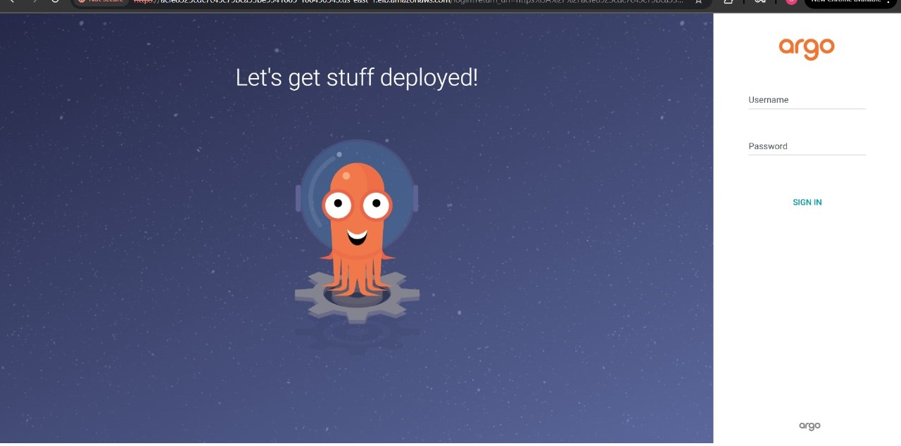
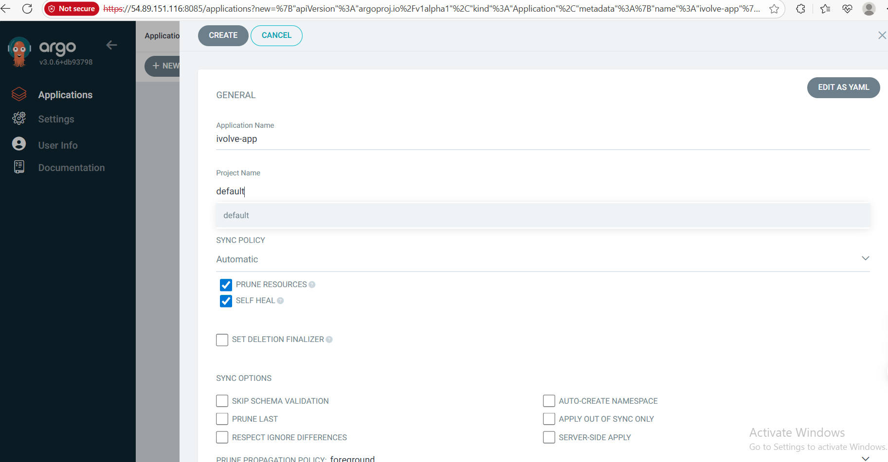
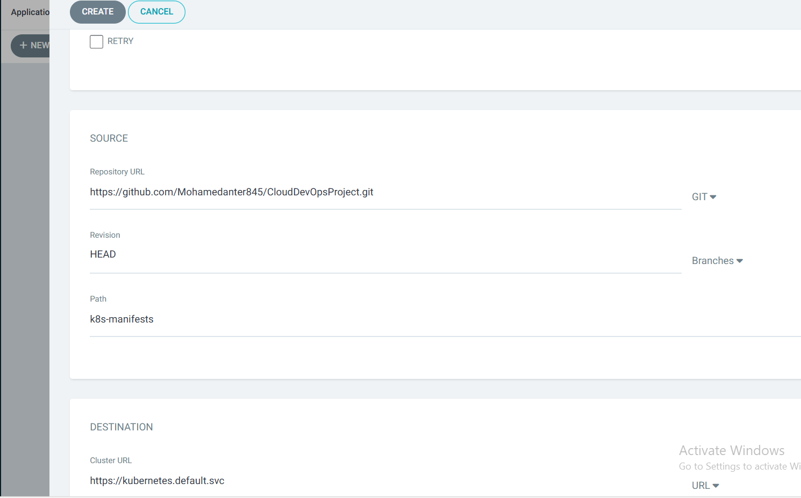
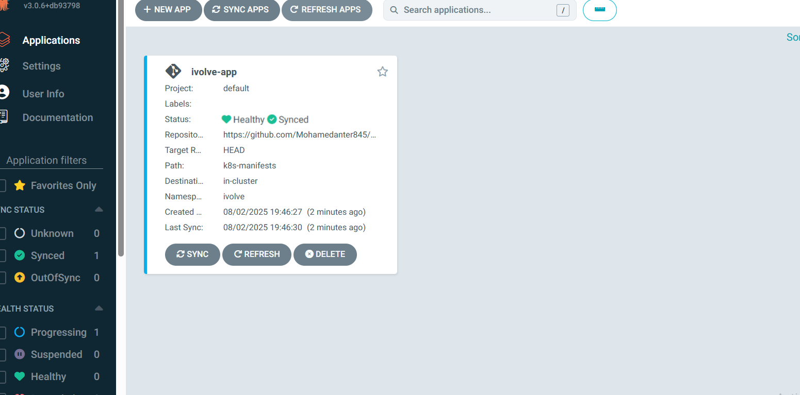
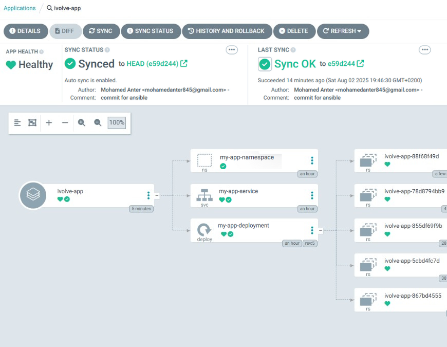

# ArgoCD Deployment Configuration for iVolve Web Application

## Prerequisites
- Kubernetes cluster with ArgoCD installed 
- Access to ArgoCD web UI (typically https://8080)
- Existing Kubernetes manifests repository 


 Access ArgoCD Web UI
1. Open  web browser and navigate to the ArgoCD URL
2. Log in using credentials (username/password)
   - to get the pass 
 ```bash 
   kubectl -n argocd get secret argocd-initial-admin-secret -o jsonpath="{.data.password}" | base64 -d; echo
   ```
 


 Verify you see the default ArgoCD dashboard
------------------------------------

Create New Application
1. Click "+ New App" button in top navigation
2. Configure application settings:

**General Section:**
- Application Name: `ivolve-app`  
- Project: `default`  
- Sync Policy:  
  ✓ Automatic sync  
  ✓ Self-Heal  


**Source Section:**
- Repository URL: 'https://github.com/Mohamedanter845/CloudDevOpsProject/tree/main/k8s-manifests' 
- Revision: `main`  
- Path: `.` (root directory of repo)  

**Destination Section:**
- Cluster: `in-cluster`  
- Namespace: `my-app-namespace`  
---------------------------
 

 Verify Initial Deployment

------
Application Details Tree
 


