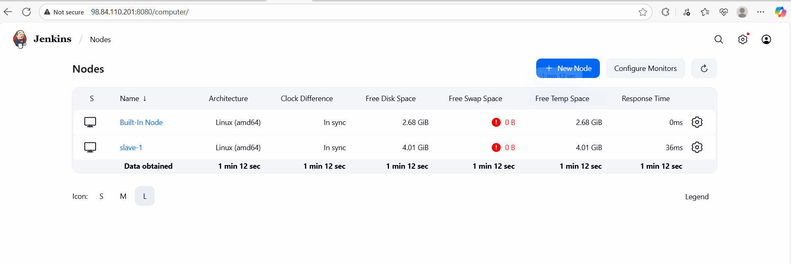
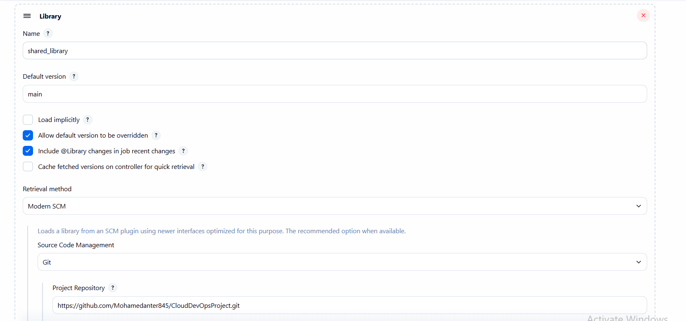
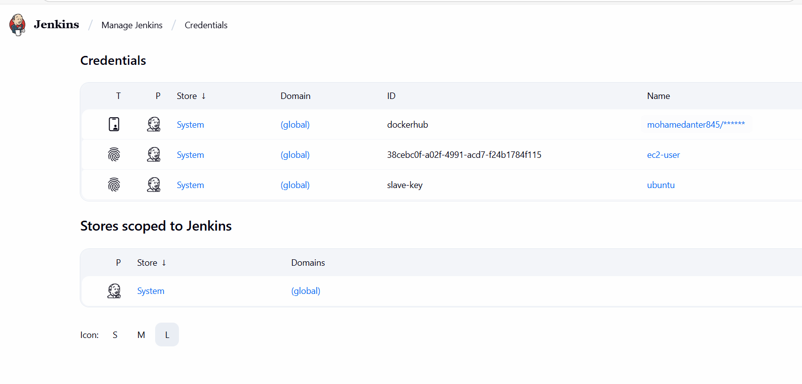
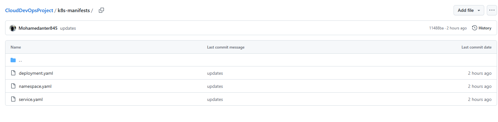
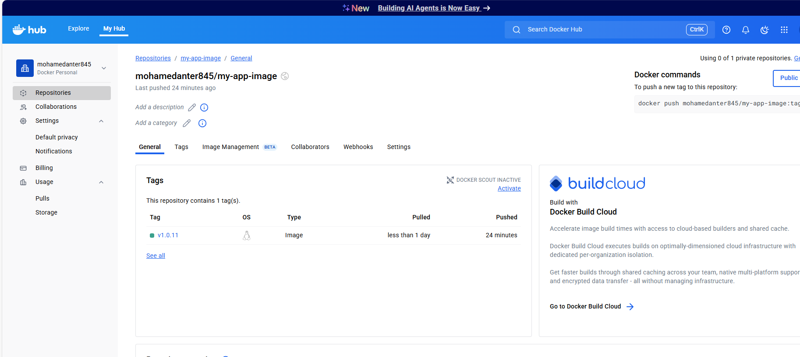

CloudDevOpsProject – Jenkins CI/CD Pipeline Setup
------------------------------------------------------
## 1. Prerequisites

- Jenkins master and slave instances provisioned using **Ansible playbooks**
- Java Development Kit (JDK) installed on both Jenkins **master and slave**
- Git installed and configured on both instances
- Docker installed and configured on the Jenkins slave
- Kubernetes cluster accessible from the Jenkins slave
- Separate GitHub repository for **Kubernetes manifests**
------------------------------------
 2. Jenkins Slave Configuration

Follow these steps to configure the Jenkins slave:

1. Log in to the Jenkins master web interface
2. Navigate to Manage Jenkins > Manage Nodes and Clouds
3. Click New Node to create a new agent
4. Enter "slave-1" as the node name and select Permanent Agent
5. Configure the node with these settings:
   - Remote root directory: /home/ubuntu
   - Labels: slave
   - Usage: Use this node as much as possible
   - Launch method: Launch agent via SSH
6. Enter the **Private IP address** of Jenkins slave instance

 Verify the slave connection appears online in the Nodes list

--------------
###Shared Library Setup
Configure the library with:
-Default version: main
-Retrieval method: Modern SCM
-Source Code Management: Git
-Repository URL of your shared library
-Credentials if required

----------------

 Credentials Configuration

Set up the required credentials in Jenkins:

1. Docker Hub credentials:
   - Navigate to Manage Jenkins > Manage Credentials
   - Add new credentials with type Username with password
   - Enter your Docker Hub username and password
   - Set ID to "docker"

2. Git SSH credentials:
   - In the same credentials section
   - Add new credentials with type SSH Username with private key
   - Enter "git" as username
   - Paste your SSH private key
   - Set ID to "git-credentials"
   - Add description "Git SSH Credentials"

##Kubernetes Manifests Preparation

Prepare your Kubernetes manifests repository:

. Add your existing Kubernetes YAML files:
   - deployment.yaml
   - service.yaml
   - ingress.yaml
   - persistent volume files
. Organize the repository with clear structure
. Modify deployment.yaml to use image placeholder:
   - Set image field to use  Docker image name with :latest tag
   - This will be updated by the pipeline

------------------------------------------------

### Verification Steps

After pipeline completion, verify all components:

1. Docker Image:
   - Log in to Docker Hub
   - Verify new image with build number tag exists

2. Kubernetes Manifests:
   - Check the Git repository commit history
   - Verify deployment.yaml was updated with new image tag

3. Application:
   - Check Kubernetes cluster for new deployment
   - Verify application pods are running with new image
   - Test application functionality
-------------------------------------------------------------------------------
